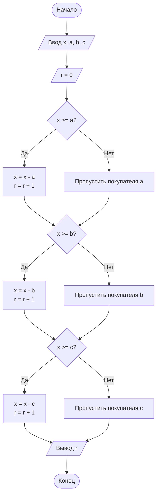

## Отчет по лабораторной работе № 2

#### № группы: `ПМ-2501`

#### Выполнил: `Закалюкина Яна Андреевна`

#### Вариант: `7`

### Cодержание:

[Задача 1](#Задача-1)
- [Постановка задачи](#1-постановка-задачи)
- [Входные и выходные данные](#2-входные-и-выходные-данные)
- [Выбор структуры данных](#3-выбор-структуры-данных)
- [Алгоритм](#4-алгоритм)
- [Программа](#5-программа)
- [Анализ правильности решения](#6-анализ-правильности-решения)
-- [Задача 2](#Задача-2)
- [Постановка задачи](#1-постановка-задачи)
- [Входные и выходные данные](#2-входные-и-выходные-данные)
- [Выбор структуры данных](#3-выбор-структуры-данных)
- [Алгоритм](#4-алгоритм)
- [Программа](#5-программа)
- [Анализ правильности решения](#6-анализ-правильности-решения)
-- [Задача 3](#Задача-3)
- [Постановка задачи](#1-постановка-задачи)
- [Входные и выходные данные](#2-входные-и-выходные-данные)
- [Выбор структуры данных](#3-выбор-структуры-данных)
- [Алгоритм](#4-алгоритм)
- [Программа](#5-программа)
- [Анализ правильности решения](#6-анализ-правильности-решения)
-- [Задача 4](#Задача-4)
- [Постановка задачи](#1-постановка-задачи)
- [Входные и выходные данные](#2-входные-и-выходные-данные)
- [Выбор структуры данных](#3-выбор-структуры-данных)
- [Алгоритм](#4-алгоритм)
- [Программа](#5-программа)
- [Анализ правильности решения](#6-анализ-правильности-решения)

### 1. Постановка задачи

> Три покупателя стоят в очереди за бананами. Они хотят купить соответственно A, B и C килограмм бананов.
Если в момент подхода очередного покупателя в магазине не хватает бананов — он уходит, ничего не купив.
Известно, что изначально в магазине есть X килограмм бананов.
Нужно определить, сколько человек смогут купить нужное им количество бананов.

Задача решается последовательно

- Приходит первый покупатель
  1) если бананов >= A → покупает (`X >= A`)
  2) иначе → уходит (`X < A`)
- Приходит первый покупатель
  1) если бананов >= B → покупает (`X >= B`)
  2) иначе → уходит (`X < B`)
- Приходит первый покупатель
  1) если бананов >= C → покупает (`X >= C`)
  2) иначе → уходит (`X < C`)

Всего надо рассмотреть `2 * 2 * 2 = 8` случаев
Считается кол-во покупателей, которым хватило бананов

### 2. Входные и выходные данные

#### Данные на вход

На вход программа должна получать 4 натуральных числа. 

|             |        Тип        | min значение | max значение |
|-------------|-------------------|--------------|--------------|
| X (Число 1) | Натуральное число |       1      |      +∞      |
| A (Число 2) | Натуральное число |       1      |      +∞      |
| B (Число 3) | Натуральное число |       1      |      +∞      |
| C (Число 4) | Натуральное число |       1      |      +∞      |


#### Данные на выход

Т.к. программа должна вывести количество покупателей, кторые смогут купить бананы, то на выход мы получим
единственное целое положительное число.

|             |            Тип            | min значение | max значение |
|-------------|---------------------------|--------------|--------------|
| R (Число 1) | Целое положительное число |       0      |       3      |

### 3. Выбор структуры данных

Программа получает 4 натуральных числа и выводит еще 1. Поэтому для их хранения
можно выделить 5 переменных (`x`, `a`, `b`, `c`, `r`) типа `int`.

|             | название переменной | Тип (в Java) | 
|-------------|---------------------|--------------|
| X (Число 1) |         `x`         |    `int`     |
| A (Число 2) |         `a`         |    `int`     |
| B (Число 3) |         `b`         |    `int`     |
| C (Число 4) |         `c`         |    `int`     |
| R (Число 5) |         `r`         |    `int`     |


### 4. Алгоритм

#### Алгоритм выполнения программы:

1. **Ввод данных:**  
   Программа считывает четыре натуральных числа, обозначенные как `x`, `a`, `b`, `c`.
   Затем инициализируется переменная `r = 0`, которая будет хранить количество покупателей, получивших бананы.

3. **Сравнение чисел:**  
   - Программа сравнивает значения `x` и `a`.
     1) Если `x` больше или равно `a`: программа переходит к следующему шагу для работы с `x`.
        `x = x - a`
        `r = r + 1`
     2) Если `x` меньше `a`: `x` остается без изменений
   - Программа сравнивает значения `x` и `b`. 
     1) Если `x` больше или равно `b`: программа переходит к следующему шагу для работы с `x`.
        `x = x - b`
        `r = r + 1`
     2) Если `x` меньше `b`: `x` остается без изменений
   - Программа сравнивает значения `x` и `c`. 
     1) Если `x` больше или равно `c`: программа переходит к следующему шагу для работы с `x`.
        `x = x - c`
        `r = r + 1`
     2) Если `x` меньше `c`: `x` остается без изменений

4. **Вывод результата:**  
   На экран выводится значение `r`.

#### Блок-схема



### 5. Программа

```java
import java.io.PrintStream;
import java.util.Scanner;

public class Main {
    // Объявляем объект класса Scanner для ввода данных
    public static Scanner in = new Scanner(System.in);
    // Объявляем объект класса PrintStream для вывода данных
    public static PrintStream out = System.out;

    public static void main(String[] args) {
        // Считывание значений x, a, b, c
        System.out.print("Количество бананов в магазине: ");
        int x = in.nextInt();

        System.out.print("Сколько бананов планирует купить покупатель A: ");
        int a = in.nextInt();

        System.out.print("Сколько бананов планирует купить покупатель B: ");
        int b = in.nextInt();

        System.out.print("Сколько бананов планирует купить покупатель C: ");
        int c = in.nextInt();

        // Инициализация счётчика покупателей
        int r = 0;

        // Проверка условий покупки
        if (x >= a) {
            x -= a; // Покупатель купил
            r++;    // Увеличиваем счётчик
        }

        if (x >= b) {
            x -= b; // Покупатель купил
            r++; // Увеличиваем счётчик
        }

        if (x >= c) {
            x -= c; // Покупатель купил
            r++;// Увеличиваем счётчик
        }

        // Вывод результата
        System.out.println("Количество человек, купивших бананы: " + r);


    }
}
```

### 6. Анализ правильности решения

Программа работает корректно на всем множестве решений.

1. Тест на `X > A > B > C`:

    - **Input**:
        ```
        30 15 14 13
        ```

    - **Output**:
        ```
        2
        ```
2. Тест на `X > A < B > C`:

    - **Input**:
        ```
        50 20 24 3
        ```

    - **Output**:
        ```
        3
        ```
3. Тест на `X > A < B < C`:

    - **Input**:
        ```
        40 10 12 20
        ```

    - **Output**:
        ```
        2
        ```
4. Тест на `X < A > B > C`:

    - **Input**:
        ```
        10 15 6 3
        ```

    - **Output**:
        ```
        2
        ```
5. Тест на `X < A < B < C`:

    - **Input**:
        ```
        5 6 10 13
        ```

    - **Output**:
        ```
        0
        ```
