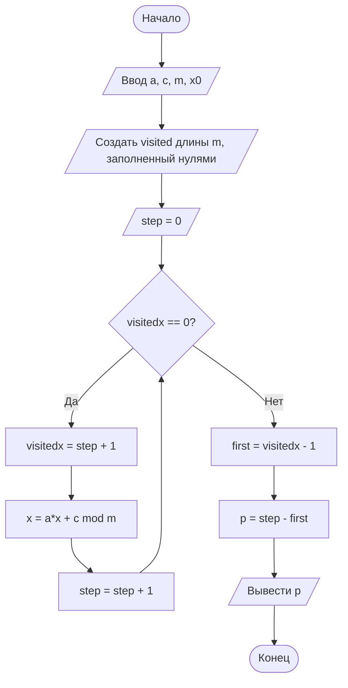
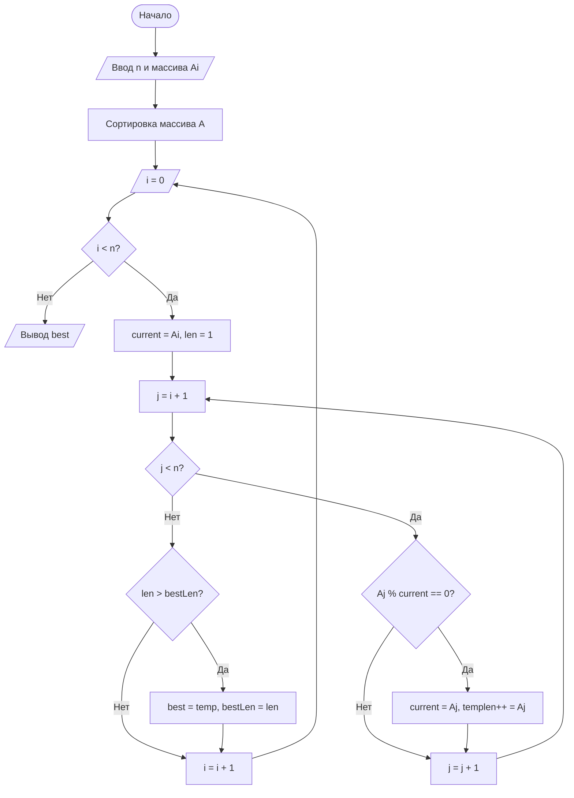

## Отчет по лабораторной работе № 2

#### № группы: `ПМ-2501`

#### Выполнил: `Закалюкина Яна Андреевна`

#### Вариант: `7`

### Cодержание:

[Задача 1](#Задача-1)
- [Постановка задачи](#1-постановка-задачи)
- [Входные и выходные данные](#2-входные-и-выходные-данные)
- [Выбор структуры данных](#3-выбор-структуры-данных)
- [Алгоритм](#4-алгоритм)
- [Программа](#5-программа)
- [Анализ правильности решения](#6-анализ-правильности-решения)

[Задача 2](#Задача-2)
- [Постановка задачи](#7-постановка-задачи)
- [Входные и выходные данные](#8-входные-и-выходные-данные)
- [Выбор структуры данных](#9-выбор-структуры-данных)
- [Алгоритм](#10-алгоритм)
- [Программа](#11-программа)
- [Анализ правильности решения](#12-анализ-правильности-решения)

[Задача 3](#Задача-3)
- [Постановка задачи](#13-постановка-задачи)
- [Входные и выходные данные](#14-входные-и-выходные-данные)
- [Выбор структуры данных](#15-выбор-структуры-данных)
- [Алгоритм](#16-алгоритм)
- [Программа](#17-программа)
- [Анализ правильности решения](#18-анализ-правильности-решения)

[Задача 4](#Задача-4)
- [Постановка задачи](#19-постановка-задачи)
- [Входные и выходные данные](#20-входные-и-выходные-данные)
- [Выбор структуры данных](#21-выбор-структуры-данных)
- [Алгоритм](#22-алгоритм)
- [Программа](#23-программа)
- [Анализ правильности решения](#24-анализ-правильности-решения)

### Задача 1
### 1. Постановка задачи

> Посмотреть, какие значения принимает последовательность при разных a0 и n, вывести закономерность, по которой строится последовательность и запрограммировать ее.

### 2. Входные и выходные данные

#### Данные на вход

> На вход программа получает два числа.
> Первая строка: натуральное число a0 — нулевой член последовательности.
> Вторая строка: n целых чисел — количество элементов последовательности.

| Переменная | Тип               | min    | max  |
| ---------- | ----------------- | ------ | ---- |
| a0         | Натуральное число | -10000 | 10000|
| n          | Натуральное число | 1      | 1000 |


#### Данные на выход

| Переменная | Тип               | min               | max |
| ---------- | ----------------- | ----------------- | --- |
| a1..a_n    | Натуральное число | зависят от a0 и n | —   |


### 3. Выбор структуры данных

Для хранения членов последовательности используется массив `int[] A` длиной `n`.

| Название | Тип (Java) | Описание                                    |
| -------- | ---------- | ------------------------------------------- |
| a0       | int        | первый член последовательности              |
| n        | int        | количество последующих членов               |
| A        | int[]      | массив членов a1..a_n                       |
| d        | int        | вспомогательное значение для вычисления a_m |
| k        | int        | количество делений на 2                     |
| i        | int        | индекс цикла                                |


### 4. Алгоритм

#### Алгоритм выполнения программы:

1. **Ввод данных:**  
   Считать `a0` и `n`.

2. **Инициализация массива**  
   `A = new int[n]`.

3. **Вычисление каждого члена**  
   Для `i = 0..n-1`:
   1. `m = i + 1` — номер члена.
   2. `k = m / 2` — сколько раз делить на 2.
   3. `d = a0 + 6`, делим `d` целочисленно на 2 `k` раз.
   4. Если `m` чётное → `A[i] = -6 + d`, иначе → `A[i] = -12 + d`.
4. **Вывод массива**
   Печать `A[0]..A[n-1]`.

#### Блок-схема


### 5. Программа

```java
import java.io.PrintStream;
import java.util.Scanner;

public class Main {
    public static Scanner in = new Scanner(System.in);
    public static PrintStream out = System.out;

    public static void main(String[] args) {

        int a0 = in.nextInt(); // ввод: нулевой член
        int n = in.nextInt();  // сколько членов a1..a_n вывести

        int[] A = new int[n];  // A[0] = a1, A[1] = a2, ...

        for (int i = 0; i < n; i++) {
            int m = i + 1;            // реальный номер члена (1..n)
            int k = m / 2;           // сколько раз делить на 2

            // d = a0 + 6, потом делим d на 2 ровно k раз
            int d = a0 + 6;
            for (int j = 0; j < k; j++) {
                d = d / 2; // целочисленное деление 
            }

            // если m чётное -> a_m = -6 + d
            // если m нечётное -> a_m = -12 + d
            if (m % 2 == 0) {
                A[i] = -6 + d;
            } else {
                A[i] = -12 + d;
            }
        }

        // вывод в строку
        for (int i = 0; i < n; i++) {
            out.print(A[i] + ", ");
        }
    }
}

```

###  6. Анализ правильности решения

Проверим работу программы на нескольких тестах:

1.
    - **Input**:
        ```
        0
        10
        ```

    - **Output**:
        ```
        -6, -3, -9, -5, -11, -6, -12, -6, -12, -6
        ```
2. 
    - **Input**:
        ```
        -1
        6
        ```

    - **Output**:
        ```
        -7, -4, -10, -5, -11, -6
        ```
3. 
    - **Input**:
        ```
        20
        4
        ```

    - **Output**:
        ```
        14, 7, 1, 0
        ```
4. 
    - **Input**:
        ```
        100
        30
        ```

    - **Output**:
        ```
        94, 47, 41, 20, 14, 7, 1, 0, -6, -3, -9, -5, -11, -6, -12, -6, -12, -6, -12, -6, -12, -6, -12, -6, -12, -6, -12, -6, -12, -6
        ```
5. 
    - **Input**:
        ```
        -1000
        15
        ```

    - **Output**:
        ```
        -1006, -503, -509, -255, -261, -131, -137, -69, -75, -38, -44, -22, -28, -14, -20
        ```
### Задача 2
### 7. Постановка задачи

> Дана последовательность из n чисел. Выведите индекс последнего элемента, перед которым количество положительных и количество отрицательных элементов встретились поровну. Если такого элемента нет – вывести "NO".

### 8. Входные и выходные данные

#### Данные на вход

> На вход программа получает две строки.
Первая строка: натуральное число n — количество элементов последовательности.
Вторая строка: n целых чисел — элементы последовательности.

|                   |        Тип        | min значение | max значение |
|-------------------|-------------------|--------------|--------------|
|         n         | Натуральное число |       1      |      100     |
|    a₁, a₂, … aₙ   |    Целые числа    |    −100000   |    100000     |


#### Данные на выход

На выход мы получим единственное целое положительное число.

|             |            Тип            | min значение | max значение |
|-------------|---------------------------|--------------|--------------|
|      R      |   Индекс или строка "NO"  |       1      |    100 (n)   |

### 9. Выбор структуры данных

Понадобятся следующие переменные:

|           Смысл           | Название | Тип     |
| ------------------------- | -------- | ------- |
|    Количество элементов   |    `n`   |  `int`  |
| Массив последовательности |   `A[]`  |  `int[]`|
|    Счётчик положительных  |   `pos`  |  `int`  |
|    Счётчик отрицательных  |   `neg`  |  `int`  |
|     Результат (индекс)    |   `res`  |  `int`  |


### 10. Алгоритм

#### Алгоритм выполнения программы:

1. **Ввод данных:**  
   Программа считывает две строки.
   Первая строка: натуральное число `n` — количество элементов последовательности.
   Вторая строка: `n` целых чисел — элементы последовательности.
   
2. **Инициализация счетчиков**  
   `pos = 0` (количество положительных элементов)
   `neg = 0` (количество отрицательных элементов)
   `res = 0` (результат)
   
3. **Обработка последовательности**  
   Для `i` от `0` до `n-1`:
      - Если `pos == neg`, то `res = i + 1`
      - Если `A[i] > 0`, то `pos++`
      - Если `A[i] < 0`, то `neg++`
4. **Формирование результата**
   Если `res == 0`, вывести `"NO"`
   Иначе вывести `res`

#### Блок-схема


### 11. Программа

```java
import java.io.PrintStream;
import java.util.Scanner;

public class Main {
    public static Scanner in = new Scanner(System.in);
    public static PrintStream out = System.out;

    public static void main(String[] args) {
        // Ввод количества элементов
        int n = in.nextInt();
        int[] A = new int[n];

        for (int i = 0; i < A.length; i++) {
            A[i] = in.nextInt();
        }
        
        int pos = 0; // количество положительных
        int neg = 0; // количество отрицательных
        int res = 0; // искомый индекс

        // Перебор элементов
        for (int i = 0; i < A.length; i++) {
            // Проверяем условие перед элементом i+1
            if (pos == neg) {
                res = i + 1; 
            }
            // Анализ текущего элемента
            if (A[i] > 0) pos++;
            else if (A[i] < 0) neg++;
        }
        // Вывод результата
        if (res == 1) {
            out.println("NO");
        } else {
            out.println(res);
        }
    }
}
```

###  12. Анализ правильности решения

Проверим работу программы на нескольких тестах:

1. 
    - **Input**:
        ```
        5
        1 -2 3 -4 5
        ```

    - **Output**:
        ```
        5
        ```
2. 
    - **Input**:
        ```
        4
        1 2 -3 -4
        ```

    - **Output**:
        ```
        4
        ```
3. 
    - **Input**:
        ```
        3
        1 -2 3
        ```

    - **Output**:
        ```
        NO
        ```
4. 
    - **Input**:
        ```
        3
        0 0 0
        ```

    - **Output**:
        ```
        NO
        ```
5. 
    - **Input**:
        ```
       6
       1 -1 2 -2 3 -3
        ```

    - **Output**:
        ```
        6
        ```
### Задача 3
### 13. Постановка задачи

> Рассматривается следующая последовательность: x n+1 = (a∗x n + c) mod m,x 0 = x0
Требуется определить длину цикла этой последовательности – наименьшее положительное целое число p, такое, что начиная с некоторого шага значения повторяются с периодом p (после, возможно, непустого начального отрезка). Вывести на экран длину периода.

### 14. Входные и выходные данные

#### Данные на вход

На вход программа получает одну строку: четыре целых числа a, c, m (m > 0), x0

|       |        Тип        | min значение | max значение  |
|-------|-------------------|--------------|---------------|
|   a   |    Целое число    |       0      |      10000    |
|   c   |    Целое число    |       0      |      10000    |
|   m   |  Натуральное число|       1      |      10000    | 
|   x₀  |    Целое число    |       0      |      10000    |


#### Данные на выход

На выход мы получим одно натуральное число - длину периода последовательности.

|     Имя     |        Тип        | min значение | max значение |
|-------------|-------------------|--------------|--------------|
|      p      |  Натуральное число|       1      |      m       |


### 15. Выбор структуры данных

Понадобятся следующие переменные:

| Переменная   | Значение                                                            | Тип     |
| ------------ | ------------------------------------------------------------------- | ------- |
| `a, c, m, x` | параметры последовательности                                        | `int`  |
| `visited`    | массив размера `m`, хранящий шаг первого появления каждого значения | `int[]` |
| `step`       | номер текущего шага                                                 | `int`   |


### 16. Алгоритм

#### Алгоритм выполнения программы:

1. **Ввод данных:**  
   Считать входные значения `a`, `c`, `m`, `x`.

2. **Инициализация массива**  
   Создать массив `visited[m]`, заполненный нулями.

3. **Инициализировать шаг**
   `step = 0`
   
5. **Вычисление**
   Пока текущее значение x ещё не встречалось `(visited[x] == 0)`:
   - записать `visited[x] = step + 1`;
   - вычислить следующее значение: `x=(a⋅x+c) mod m`
   - увеличить `step`.
     
6. **При повторе значения `x`**
   - первое появление было на шаге `first = visited[x] - 1`
   - период: `p=step−first`
     
7. **Вывод результата:**  
   На экран выводится значение `p`.

#### Блок-схема



### 17. Программа

```java
import java.io.PrintStream;
import java.util.Scanner;

public class Main {
    public static Scanner in = new Scanner(System.in);
    public static PrintStream out = System.out;

    public static void main(String[] args) {
        int a = in.nextInt();
        int c = in.nextInt();
        int m = in.nextInt();
        int x = in.nextInt();

        int[] visited = new int[m];  // по умолчанию заполнен нулями
        int step = 0;

        // visited[x] = 0 означает "ещё не посещали"
        while (visited[x] == 0) {
            visited[x] = step + 1;  // храним step+1, чтобы отличать от 0
            x = (a * x + c) % m;
            step++;
        }

        int first = visited[x] - 1; // возвращаем реальный step
        int p = step - first;

        out.println(p);
    }
}

```

###  18. Анализ правильности решения

Проверим работу программы на нескольких тестах:

1. 
    - **Input**:
        ```
        2 3 10 1
        ```

    - **Output**:
        ```
        4
        ```
2. 
    - **Input**:
        ```
        1 1 5 0
        ```

    - **Output**:
        ```
        3
        ```
3. 
    - **Input**:
        ```
         1 0 10 5
        ```

    - **Output**:
        ```
        1
        ```
4. 
    - **Input**:
        ```
        3 2 7 0
        ```

    - **Output**:
        ```
        6
        ```
5. 
    - **Input**:
        ```
        2 1 15 1
        ```

    - **Output**:
        ```
        4
        ```
### Задача 4
### 19. Постановка задачи

> Дано множество различных положительных целых чисел, записанных в порядке возрастания. Требуется найти наибольшее по размеру подмножество, такое, что для любых двух чисел из этого подмножества одно из них делится на другое без остатка. Если существует несколько таких подмножеств одинакового размера – можно вывести любое из них.

### 20. Входные и выходные данные

#### Данные на вход

На вход программа получает две строки
Первая строка: n – число элементов множества
Вторая строка: множество из n чисел

|                   |        Тип        | min значение | max значение |
|-------------------|-------------------|--------------|--------------|
|         n         |    Целые числа    |       1      |    10000     |
|    a₁, a₂, … aₙ   |    Целые числа    |        1      |    10000    |


#### Данные на выход

На выход мы получим элементы найденного максимального подмножества.

### 21. Выбор структуры данных

Понадобятся следующие переменные:

| Переменная | Тип     | Назначение                            |
| ---------- | ------- | ------------------------------------- |
| `n`        | `int`   | количество чисел                      |
| `a[]`      | `int[]` | исходное множество                    |
| `best[]`   | `int[]` | лучшее найденное подмножество         |
| `temp[]`   | `int[]` | временное подмножество при переборе   |
| `bestLen`  | `int`   | длина лучшего подмножества            |
| `len`      | `int`   | временная длина текущего подмножества |
| `current`  | `int`   | последнее добавленное число в цепочке |


### 22. Алгоритм

#### Алгоритм выполнения программы:

1. **Ввод данных:**  
   Ввести `n` и массив из `n` чисел.

2.**Отсортировать массив**
   Отсортировать массив по возрастанию (пузырьковой сортировкой).
   
3. **Вычисление**  
   Для каждого числа массива:
   - начать новое подмножество с этого числа;
   - последовательно добавлять следующие числа, делящиеся на текущее `(a[j] % current == 0)`;
   - обновлять `current`.
     
4. **Проверка**
   Если длина найденного подмножества больше текущего лучшего — сохранить его.

5. **Вывод результата:**  
   Вывести найденное подмножество.

#### Блок-схема



### 23. Программа

```java
import java.io.PrintStream;
import java.util.Scanner;

public class Main {
    public static Scanner in = new Scanner(System.in);
    public static PrintStream out = System.out;

    public static void main(String[] args) {

        int n = in.nextInt();
        int[] A = new int[n];

        for (int i = 0; i < n; i++)
            A[i] = in.nextInt();

        // Пузырьковая сортировка
        for (int i = 0; i < n; i++)
            for (int j = 0; j < n - 1; j++)
                if (A[j] > A[j + 1]) {
                    int t = A[j];
                    A[j] = A[j + 1];
                    A[j + 1] = t;
                }

        int bestLen = 1;
        int[] best = new int[n];

        // Поиск цепочки
        for (int i = 0; i < n; i++) {
            int current = A[i];
            int len = 1;
            int[] temp = new int[n];
            temp[0] = current;

            for (int j = i + 1; j < n; j++)
                if (A[j] % current == 0) {
                    temp[len++] = A[j];
                    current = A[j];
                }

            if (len > bestLen) {
                bestLen = len;
                for (int k = 0; k < len; k++)
                    best[k] = temp[k];
            }
        }

        for (int i = 0; i < bestLen; i++)
            out.print(best[i] + " ");
    }
}

```

###  24. Анализ правильности решения

Проверим работу программы на нескольких тестах:

1. 
    - **Input**:
        ```
        6
        1 2 3 4 6 12
        ```

    - **Output**:
        ```
        1 2 4 12
        ```
2. 
    - **Input**:
        ```
        5
        5 10 20 7 14
        ```

    - **Output**:
        ```
        5 10 20
        ```
3. 
    - **Input**:
        ```
         4
         3 5 7 11
        ```

    - **Output**:
        ```
        3
        ```
4. 
    - **Input**:
        ```
        3
        1 2 3
        ```

    - **Output**:
        ```
        1 2
        ```
5. 
    - **Input**:
        ```
        10
        5 6 9 7 3 15 48 54 7 16
        ```

    - **Output**:
        ```
        3 6 48
        ```
